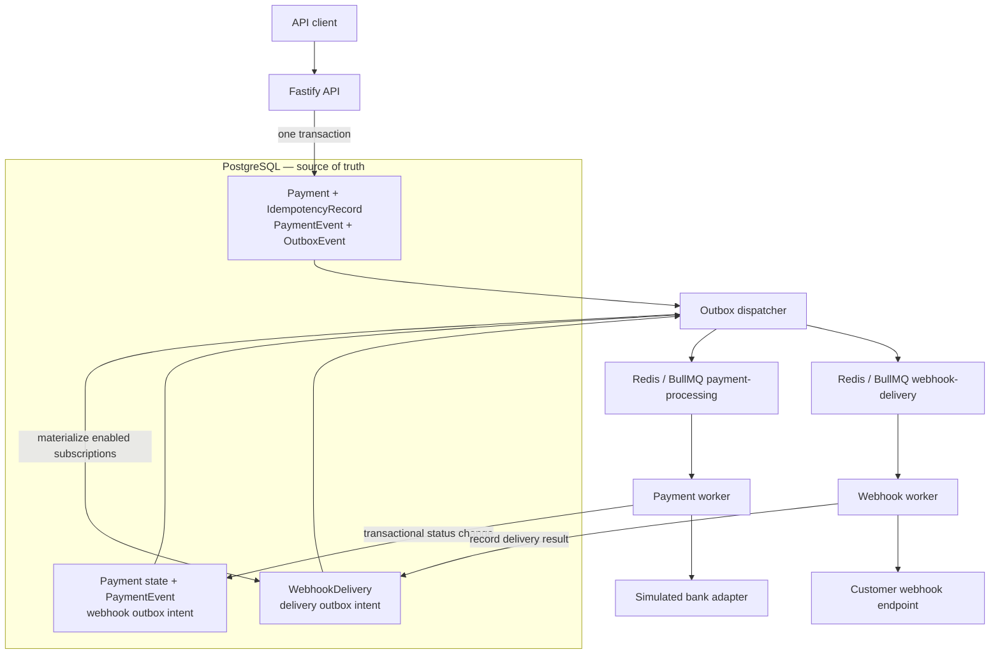
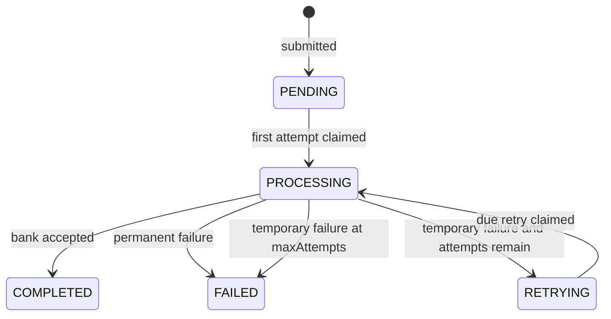
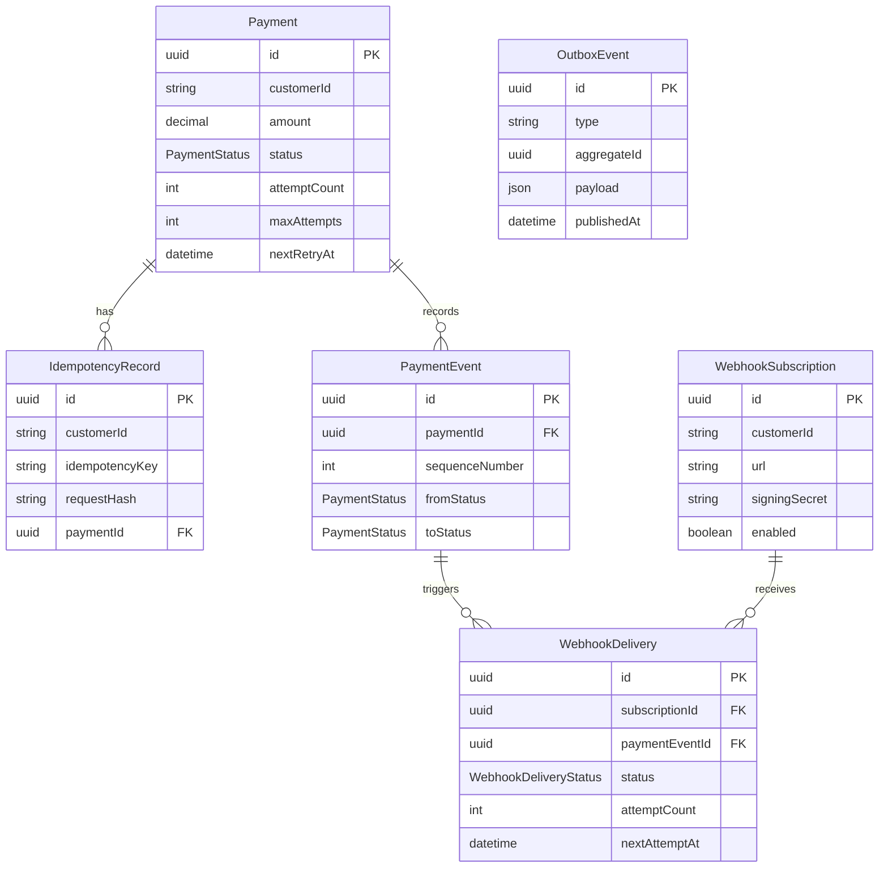

# ACH Payment Processing Service

A production-style take-home backend that accepts ACH payment requests, stores them safely, and processes them asynchronously. It provides customer-scoped idempotency, deterministic retries for temporary bank failures, payment status and audit APIs, and signed webhook notifications for every status change.

PostgreSQL is the source of truth. Redis and BullMQ transport asynchronous work; they do not determine payment state.

## Assignment deliverables

1. [High-level architecture and solution approach](docs/architecture.md)
2. [Data model](docs/data-model.md)
3. [API design](docs/api-design.md)
4. Code implementation in `src/`, with tests in `tests/`

`docs/PERSONAL_PROJECT_GUIDE.md` is a separate learning aid and is not part of the formal deliverables.

## Key design goals

- **Reliability:** business state and asynchronous intent are committed together using a transactional outbox.
- **Idempotency:** repeated client requests and duplicate queue jobs cannot execute the same logical payment twice.
- **Asynchronous processing:** the submission API returns while payment execution continues in workers.
- **Auditability:** every payment state transition creates an ordered, append-only `PaymentEvent`.
- **Retry safety:** temporary failures use bounded exponential backoff; permanent failures stop immediately.
- **Webhook isolation:** delivery failures are tracked and retried without changing payment state.
- **Separation of responsibilities:** routes, services, repositories, queues, adapters, and workers have distinct roles.

## Tech stack

| Technology | Purpose |
| --- | --- |
| Node.js 24+ | JavaScript runtime |
| TypeScript | Static types and build output |
| Fastify | HTTP API and request validation |
| PostgreSQL | Durable source of truth |
| Prisma | Schema, migrations, and type-safe database access |
| Redis | BullMQ backing store |
| BullMQ | Payment and webhook job queues, including delayed jobs |
| Vitest | Unit and integration tests |
| Docker Compose | Local PostgreSQL and Redis |
| Swagger/OpenAPI | Interactive API documentation |

## Architecture



The API, outbox dispatcher, payment worker, and webhook worker run as separate processes. Payment processing never waits for webhook delivery.

### Transactional outbox

A naive implementation might commit a payment to PostgreSQL and then publish a Redis job. A crash between those operations leaves a saved payment with no work queued. Reversing the order creates the opposite problem: a worker could receive a job for data that was never committed.

This service writes the business records and an `OutboxEvent` in the same PostgreSQL transaction. The outbox dispatcher later publishes that durable intent to BullMQ and marks it published only after publication succeeds. Retrying publication is safe because BullMQ job IDs are deterministic and workers conditionally claim database state.

## Payment lifecycle



`COMPLETED` and `FAILED` are terminal. Every arrow is recorded as a `PaymentEvent` in the same database transaction as the payment update.

## Idempotency and duplicate prevention

`POST /v1/payments` requires an `Idempotency-Key`. The key is scoped by `customerId`:

- The request is trimmed and the amount is normalized to two decimal places.
- A canonical representation is hashed with SHA-256.
- Same key and same normalized request: return the original payment with `200 OK`.
- Same key and different request: return `409 Conflict`.
- `@@unique([customerId, idempotencyKey])` resolves concurrent submissions safely.

BullMQ uses stable job IDs. Database claims also require the expected state and attempt number, so duplicate, stale, terminal, or early jobs cannot cause another bank call. The simulated bank receives the stable execution key `payment-<paymentId>` for downstream idempotency.

## Retry strategy

The bank adapter distinguishes success, permanent failure, and temporary failure:

- Permanent failures transition directly to `FAILED`.
- Temporary failures schedule a delayed retry if attempts remain.
- A temporary failure on the final allowed attempt becomes `FAILED` with `RETRY_EXHAUSTED`.

Backoff has no jitter and is intentionally easy to explain:

```text
delay = baseDelayMs * 2^(failedAttemptNumber - 1)
```

`attemptCount` starts at `0`; the first claimed bank attempt changes it to `1`. `maxAttempts` includes the original attempt and defaults to `5`. Retry jobs use `<paymentId>-attempt-<nextAttemptNumber>`.

The reference-based simulator is only for reproducible local testing:

| Reference contains | Result |
| --- | --- |
| `SUCCESS` or no failure marker | Immediate success |
| `PERM_FAIL` | Permanent failure |
| `TEMP_FAIL` | Temporary failure on every attempt, then exhaustion |
| `TEMP_FAIL_ONCE` | Temporary failure once, success on attempt 2 |
| `TEMP_FAIL_TWICE` | Temporary failure twice, success on attempt 3 |

## Webhooks

Customers register a URL and signing secret. Each committed payment status event is materialized into one `WebhookDelivery` per enabled subscription. Delivery jobs use the `webhook-delivery` queue and deterministic IDs of `<webhookDeliveryId>-attempt-<attemptNumber>`.

Example payload:

```json
{
  "eventId": "70fd69e8-5236-4af9-9fa0-4e997a865e66",
  "eventType": "payment.status_changed",
  "paymentId": "1b882afa-019b-47f3-bd54-37c1cfe33929",
  "customerId": "C12345",
  "fromStatus": "PROCESSING",
  "toStatus": "COMPLETED",
  "reason": "Payment completed",
  "occurredAt": "2026-09-06T12:00:00.000Z"
}
```

The exact UTF-8 bytes of `JSON.stringify(payload)` are signed:

```text
hex(HMAC-SHA256(signingSecret, rawRequestBody))
```

Outgoing headers are:

- `Content-Type: application/json`
- `X-Webhook-Signature: <hex HMAC>`
- `X-Webhook-Event-Id: <paymentEventId>`
- `X-Webhook-Timestamp: <ISO-8601 attempt time>`

Any `2xx` response succeeds. Network errors, timeouts, and non-`2xx` responses retry with exponential backoff up to `WEBHOOK_MAX_ATTEMPTS`. Delivery status, attempts, response status, error, next attempt time, and delivery time are stored. Webhook failure never changes payment status.

## Data model



| Model | Purpose | Important constraint |
| --- | --- | --- |
| `Payment` | Current payment state and processing fields | UUID primary key; unique bank execution ID |
| `IdempotencyRecord` | Connects a customer/key/hash to its payment | Unique `(customerId, idempotencyKey)` |
| `PaymentEvent` | Append-only transition history | Unique `(paymentId, sequenceNumber)` |
| `OutboxEvent` | Durable asynchronous intent | Indexed by publication state and creation time |
| `WebhookSubscription` | Customer callback configuration | Indexed by customer and enabled state |
| `WebhookDelivery` | Per-subscription delivery state | Unique `(subscriptionId, paymentEventId)` |

Payment amounts use PostgreSQL `DECIMAL(18,2)` and Prisma `Decimal`, never binary floating point. See [docs/data-model.md](docs/data-model.md) for field-level detail.

## API

| Method | Path | Purpose | Important responses |
| --- | --- | --- | --- |
| `GET` | `/health/live` | Process liveness | `200` |
| `POST` | `/v1/payments` | Submit an idempotent payment | `202`, replay `200`, validation `400`, conflict `409` |
| `GET` | `/v1/payments/:paymentId` | Retrieve payment status | `200`, malformed ID `400`, unknown ID `404` |
| `GET` | `/v1/payments/:paymentId/events` | Retrieve ordered audit history | `200`, `400`, `404` |
| `POST` | `/v1/webhooks/subscriptions` | Create a subscription | `201`, `400` |
| `GET` | `/v1/webhooks/subscriptions/:customerId` | List enabled customer subscriptions | `200`, `400` |
| `PATCH` | `/v1/webhooks/subscriptions/:subscriptionId` | Enable or disable a subscription | `200`, `400`, `404` |

Interactive Swagger documentation is available at [http://localhost:3000/docs](http://localhost:3000/docs) while the API is running.

### Submit a payment

```bash
curl -i -X POST http://localhost:3000/v1/payments \
  -H 'Content-Type: application/json' \
  -H 'Idempotency-Key: payment-demo-1001' \
  -d '{
    "customerId": "C12345",
    "sourceAccount": "VA10001",
    "destinationAccount": "EXT98765",
    "amount": "250.00",
    "reference": "SUCCESS-DEMO"
  }'
```

### Retrieve a payment and its audit history

Set the ID returned by submission, then query it.

```bash
PAYMENT_ID='replace-with-returned-payment-uuid'
curl "http://localhost:3000/v1/payments/$PAYMENT_ID"
curl "http://localhost:3000/v1/payments/$PAYMENT_ID/events"
```

### Create and list webhook subscriptions

```bash
curl -i -X POST http://localhost:3000/v1/webhooks/subscriptions \
  -H 'Content-Type: application/json' \
  -d '{
    "customerId": "C12345",
    "url": "http://localhost:4000/success",
    "signingSecret": "local-webhook-secret"
  }'

curl http://localhost:3000/v1/webhooks/subscriptions/C12345
```

Loopback HTTP is allowed outside production; other subscription URLs require HTTPS. Secrets are write-only and never returned.

### Enable or disable a subscription

```bash
SUBSCRIPTION_ID='replace-with-returned-subscription-uuid'
curl -i -X PATCH "http://localhost:3000/v1/webhooks/subscriptions/$SUBSCRIPTION_ID" \
  -H 'Content-Type: application/json' \
  -d '{ "enabled": false }'
```

## Local setup

### Prerequisites

- Node.js 24 or newer
- npm
- Docker Desktop with Docker Compose
- Git

From a fresh clone:

```bash
npm install
cp .env.example .env
docker compose up -d
npm run prisma:generate
npm run prisma:migrate
```

Verify infrastructure:

```bash
docker compose ps
docker compose exec -T postgres pg_isready -U ach -d ach_payments
docker compose exec -T redis redis-cli ping
```

Run each long-lived process in its own terminal:

```bash
# Terminal 1: API and Swagger
npm run dev
```

```bash
# Terminal 2: PostgreSQL outbox to BullMQ
npm run worker:outbox
```

```bash
# Terminal 3: payment execution
npm run worker:payment
```

```bash
# Terminal 4: webhook delivery
npm run worker:webhook
```

Optional development receiver:

```bash
# Terminal 5
WEBHOOK_RECEIVER_SECRET=local-webhook-secret npm run dev:webhook-receiver
```

It exposes `POST /success` (`200`) and `POST /fail` (`500`) at `http://localhost:4000` and prints the body and signature headers.

For a production-style build:

```bash
npm run build
npm start
```

Stop local infrastructure without deleting its named volumes:

```bash
docker compose down
```

## Testing

```bash
npm run build
npm test
git diff --check
npx prisma validate
```

The final verified suite contains **124 passing tests**. Coverage includes validation boundaries, normalized idempotency, concurrent submissions and worker claims, state transitions, retries and exhaustion, audit ordering, outbox failure/recovery, BullMQ duplication, webhook subscription rules, exact HMAC signing, delivery retries, terminal-state protection, and end-to-end asynchronous flows.

Integration tests require the Docker Compose PostgreSQL and Redis services. Test data uses unique prefixes and isolated queue names, and cleanup is scoped to records created by each suite.

## Assumptions and scope

- The service handles one configured currency, assumed to be USD; currency conversion is not modeled.
- Account identifiers are opaque tokens. The service does not validate routing/account-number semantics.
- Authentication and authorization are intentionally omitted for take-home scope.
- `COMPLETED` means accepted/executed by the simulated bank, not finally settled through the ACH network.
- Real settlement, returns, reversals, cancellations, refunds, reconciliation, and NACHA file generation are outside scope.
- The deterministic bank reference markers are testing controls, not a production banking protocol.

## Production considerations

The implementation demonstrates the core reliability patterns while keeping the assignment runnable. Reasonable production follow-ups include:

- authentication, authorization, rate limiting, and tenant isolation;
- a real bank integration with credential management and partner-specific idempotency;
- encryption or a secret manager for webhook secrets, plus secret rotation;
- structured logs, metrics, tracing, dashboards, and alerts;
- leases/reconciliation for work claimed immediately before a worker process dies;
- outbox, audit, and BullMQ retention/archival policies;
- signed-timestamp validation guidance and replay windows for webhook consumers;
- PostgreSQL and Redis high availability, backups, and disaster recovery;
- dead-letter queues and operator replay tooling;
- historical webhook backfill if subscriptions must receive earlier events;
- stricter SSRF controls and destination allow/deny policies for webhook URLs.

These are deliberate next steps rather than hidden dependencies of the local take-home implementation.
