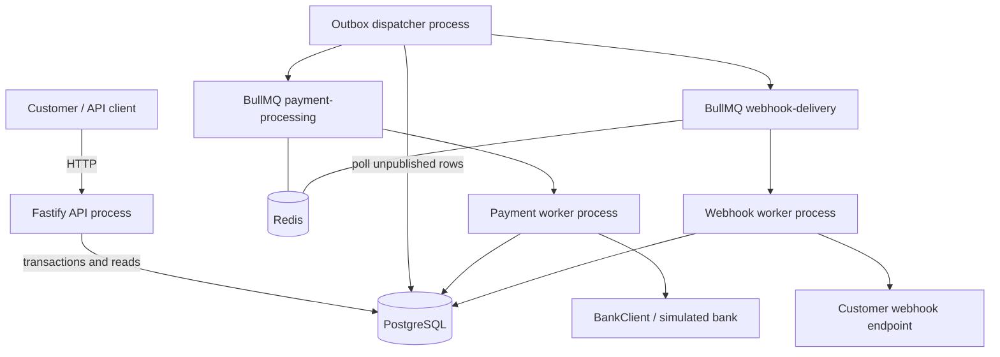
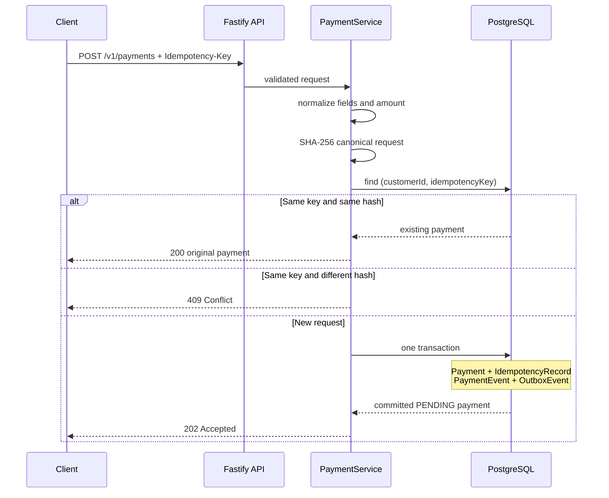
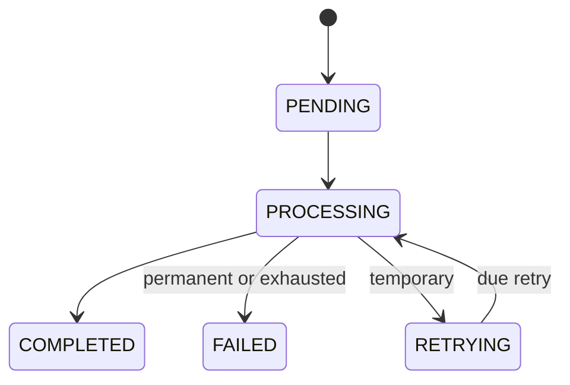
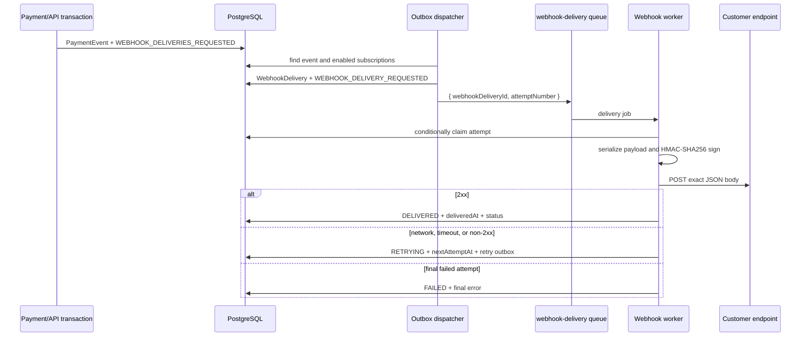

# Architecture and Solution Approach

## Purpose

The service accepts ACH payment instructions, returns quickly with a durable `PENDING` payment, processes that payment asynchronously, exposes status and audit history, and notifies subscribed customers of state changes.

The design prioritizes the risks that matter most in a payment workflow:

- accepting a request without losing the work;
- preventing repeated requests or queue messages from executing twice;
- distinguishing temporary failures from terminal failures;
- recording every state transition;
- keeping customer webhook availability outside the payment outcome.

## System context



PostgreSQL is authoritative for payment state, attempts, due times, audit events, outbox state, subscriptions, and webhook delivery state. Redis/BullMQ is a delivery mechanism. A job is permission to try claiming work; it is not proof that the work is currently eligible.

## Major components

| Component | Responsibility | Representative files |
| --- | --- | --- |
| Fastify API | Validation, HTTP status mapping, OpenAPI | `src/api/routes/`, `src/api/schemas/`, `src/app.ts` |
| Payment service | Normalization, hashing, idempotency behavior, response mapping | `src/services/payment-service.ts` |
| Payment repositories | Atomic persistence, conditional claims, state changes, audit/outbox writes | `src/repositories/prisma-payment-repository.ts`, `src/repositories/prisma-payment-processing-repository.ts` |
| Outbox dispatcher | Turns committed outbox intent into BullMQ jobs | `src/workers/outbox-dispatcher.ts` |
| Payment queue/worker | Carries and executes payment attempts | `src/queues/payment-queue.ts`, `src/workers/payment-worker.ts` |
| Payment processor | Applies bank outcomes and retry policy | `src/services/payment-processor.ts` |
| Bank adapter | Defines the bank boundary and deterministic local implementation | `src/bank/bank-client.ts`, `src/bank/simulated-bank-client.ts` |
| Webhook materializer | Creates one delivery per enabled subscription/event | `src/services/webhook-event-materializer.ts` |
| Webhook queue/worker | Carries and executes webhook delivery attempts | `src/queues/webhook-queue.ts`, `src/workers/webhook-worker.ts` |
| Webhook processor | Builds, signs, sends, and records notifications | `src/services/webhook-delivery-processor.ts` |

## Payment submission flow



The database uniqueness constraint is the final concurrency guard. A preliminary lookup improves the normal path, but the code also catches a concurrent unique-constraint conflict and resolves the record that won.

## Transactional outbox

### The dual-write problem

Writing business data and publishing a queue message are two separate systems. Without a transaction that spans both systems, either ordering has a failure window:

1. Database first: the process can die before publishing, leaving unprocessed business data.
2. Queue first: the database transaction can fail after a worker has received the message.

### This implementation

Business state and asynchronous intent are written to PostgreSQL together. The outbox dispatcher polls unpublished rows and performs the external Redis write later.

| Outbox type | Meaning | Result |
| --- | --- | --- |
| `PAYMENT_PROCESS_REQUESTED` | A new payment is ready | Immediate payment job |
| `PAYMENT_RETRY_REQUESTED` | A retry is due in the future | Delayed payment job |
| `WEBHOOK_DELIVERIES_REQUESTED` | A payment event needs subscription fan-out | Materialize delivery rows and job outboxes |
| `WEBHOOK_DELIVERY_REQUESTED` | A webhook attempt is ready or scheduled | Immediate/delayed webhook job |

An outbox row is marked `publishedAt` only after its action succeeds. Failures increment `publishAttempts` and retain `lastError`. A repeated publication is safe because queue IDs are deterministic and database claims are conditional.

Unknown payment outbox types are not silently consumed. They remain available for investigation or a future dispatcher implementation.

## Payment processing flow

1. The outbox dispatcher adds `{ paymentId }` to `payment-processing` using `paymentId` as the initial job ID.
2. The payment worker loads PostgreSQL state.
3. A conditional database update claims only `PENDING`, or a due `RETRYING` payment with the expected next attempt number.
4. The claim increments `attemptCount`, clears `nextRetryAt`, changes the state to `PROCESSING`, and adds an audit event in one transaction.
5. The worker calls `BankClient.executePayment` with the stable execution key `payment-<paymentId>`.
6. The result is committed with its audit event:
   - success: `COMPLETED`;
   - permanent failure: `FAILED`;
   - temporary failure with attempts remaining: `RETRYING` plus retry outbox;
   - temporary failure on the final attempt: `FAILED` with `RETRY_EXHAUSTED`.



## Retry and claim safety

Payment delay after failed attempt `n`:

```text
PAYMENT_RETRY_BASE_DELAY_MS * 2^(n - 1)
```

Webhook delay uses the same formula with `WEBHOOK_RETRY_BASE_DELAY_MS`.

The following layers serve different purposes:

- **Deterministic job IDs** prevent duplicate jobs for the same logical attempt while retained jobs exist.
- **Expected attempt numbers** reject stale jobs.
- **Conditional updates** allow only one concurrent worker to increment and claim an attempt.
- **Terminal-state checks** reject work for completed/failed records.
- **Due-time checks** prevent early execution. A genuinely early BullMQ job is moved back to the database due time.
- **Stable bank execution key** lets a real downstream adapter apply its own idempotency across payment retries.

The database checks are essential because queue deduplication alone is not a permanent source of truth.

## Webhook architecture

Webhook work is deliberately downstream of payment persistence:



`WebhookDelivery` uniqueness on `(subscriptionId, paymentEventId)` makes repeated fan-out safe. Subscription enabled state is checked both when deliveries are created and when the worker claims them. The signing secret is loaded internally and is never included in API responses or event bodies.

Payment success does not depend on webhook success. A customer endpoint can be unavailable while the payment remains correctly `COMPLETED` or `FAILED`.

## Reliability strategy by failure

| Failure | Response |
| --- | --- |
| Duplicate API submission | Return original or `409`, based on normalized hash |
| Concurrent submissions | Database unique constraint selects one winner |
| Redis unavailable during publication | Keep outbox unpublished, increment attempts, try again |
| Duplicate payment job | Conditional claim prevents another bank call |
| Temporary bank problem | Persist due time and publish a delayed retry |
| Permanent bank rejection | Fail immediately without retry |
| Early/stale retry | Re-delay an early current attempt; ignore stale attempt numbers |
| Duplicate webhook materialization | Database uniqueness keeps one delivery per subscription/event |
| Webhook endpoint unavailable | Record error and retry independently |
| Worker receives terminal work | Skip without external side effects |

## Design decisions and tradeoffs

### Separate processes

The API, dispatcher, payment worker, and webhook worker can be scaled or restarted independently. This is slightly more operational work than one process, but it prevents slow bank/webhook calls from consuming API capacity.

### PostgreSQL as source of truth

Queues are excellent at transporting work but are not the payment ledger. Keeping state, attempts, and due times in PostgreSQL makes duplicate/stale messages safe and makes status explainable after Redis restarts.

### Polling outbox

Simple interval polling is appropriate for a take-home and easy to run locally. Production scale may use row locking, partitioning, notifications/CDC, or a dedicated outbox platform.

### Deterministic simulator

Reference markers make tests repeatable and demonstrate policy branches without a bank dependency. A production adapter would map real partner responses into the same success/permanent/temporary result contract.

### Bounded retries without jitter

No jitter keeps behavior deterministic and understandable. A high-volume production system would normally add bounded jitter to reduce synchronized retries.

### Known crash-after-claim gap

Conditional claiming prevents duplicates, but a process can die after a claim and before persisting its result. A production follow-up would add claim leases and a reconciliation/reaper process. This omission keeps the assignment focused without weakening the demonstrated idempotency and outbox patterns.
