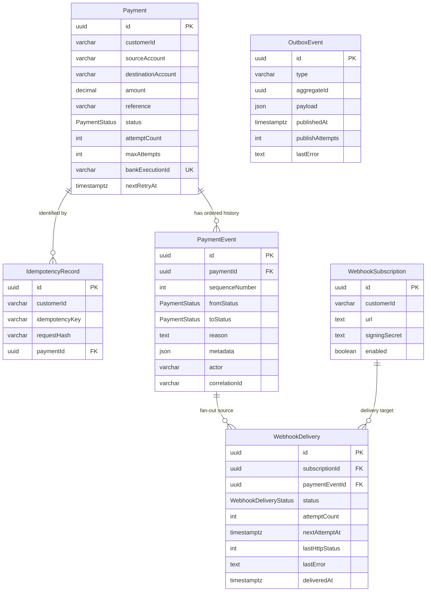

# Data Model

The schema is defined in `prisma/schema.prisma`, and the checked-in migration under `prisma/migrations/` creates the PostgreSQL objects. PostgreSQL is the authoritative store for both current state and asynchronous work intent.

## Relationship overview

`OutboxEvent.aggregateId` is a logical aggregate identifier rather than a foreign key because different event types refer to payments, payment events through payloads, or webhook deliveries.

## Enums

### `PaymentStatus`

| Value | Meaning |
| --- | --- |
| `PENDING` | Accepted and waiting for the first worker claim |
| `PROCESSING` | A worker has claimed the current bank attempt |
| `RETRYING` | A temporary failure occurred and a future attempt is scheduled |
| `COMPLETED` | The simulated bank accepted/executed the payment |
| `FAILED` | A permanent failure or retry exhaustion occurred |

Allowed transitions are enforced in `src/domain/payment-state-machine.ts` and by conditional database updates.

### `WebhookDeliveryStatus`

| Value | Meaning |
| --- | --- |
| `PENDING` | No HTTP attempt has occurred yet |
| `RETRYING` | A failed attempt has a future retry time |
| `DELIVERED` | A `2xx` response was recorded |
| `FAILED` | Delivery exhausted attempts or was stopped after disablement |

## `Payment`

Stores the current payment view and processing state.

| Field | Type | Purpose |
| --- | --- | --- |
| `id` | UUID | Public payment identifier |
| `customerId` | `varchar(255)` | Customer scope, including idempotency/subscriptions |
| `sourceAccount` | `varchar(255)` | Opaque source account token |
| `destinationAccount` | `varchar(255)` | Opaque destination account token |
| `amount` | `decimal(18,2)` | Exact monetary amount |
| `reference` | `varchar(255)` | Client reference; also controls the local simulator |
| `status` | `PaymentStatus` | Current lifecycle state |
| `attemptCount` | integer | Number of claimed bank attempts; starts at zero |
| `maxAttempts` | integer | Total allowed attempts, including the first |
| `bankExecutionId` | nullable `varchar(255)` | Identifier returned on bank success |
| `failureCode` | nullable `varchar(100)` | Latest/final bank failure category |
| `failureMessage` | nullable text | Latest/final failure explanation |
| `nextRetryAt` | nullable `timestamptz(3)` | Earliest allowed retry claim |
| `createdAt`, `updatedAt` | `timestamptz(3)` | Record timestamps |
| `completedAt` | nullable `timestamptz(3)` | Completion timestamp |

Indexes and constraints:

- primary key on `id`;
- unique `bankExecutionId` when present;
- index `(customerId, createdAt)` for customer/time access patterns;
- index `(status, nextRetryAt)` for retry/reconciliation access patterns.

### Why `Decimal` is used for money

Binary floating-point values cannot exactly represent many decimal fractions. For example, a calculation involving `0.1` can contain a small binary rounding error. Payments require exact decimal storage, so the API accepts amount as a string, normalizes it to two decimal places, Prisma uses `Decimal`, and PostgreSQL stores `DECIMAL(18,2)`. The supported positive range is up to `9999999999999999.99`.

Currency is intentionally not modeled; this assignment assumes a single configured currency (USD).

## `IdempotencyRecord`

Maps one customer-scoped idempotency key and canonical request hash to the payment that was created.

| Field | Purpose |
| --- | --- |
| `customerId` | Makes the same key usable by different customers |
| `idempotencyKey` | Client-provided retry token |
| `requestHash` | SHA-256 of normalized payment fields |
| `paymentId` | Foreign key to the original payment |
| `createdAt` | Creation timestamp |

Constraints:

- unique `(customerId, idempotencyKey)` prevents concurrent duplicate winners;
- index on `paymentId` supports reverse lookup;
- restricted delete protects the referenced payment.

## `PaymentEvent`

Represents one payment state transition. Application code treats these records as append-only.

| Field | Purpose |
| --- | --- |
| `paymentId` | Foreign key to `Payment` |
| `sequenceNumber` | Per-payment ordering starting at 1 |
| `fromStatus` | Previous state; nullable for initial submission |
| `toStatus` | New state |
| `reason` | Human-readable transition reason |
| `metadata` | Optional structured context; not returned by the public audit API |
| `actor` | Component responsible, such as `api` or `payment-worker` |
| `correlationId` | Connects related activity |
| `createdAt` | Occurrence timestamp |

Constraints:

- unique `(paymentId, sequenceNumber)` prevents ambiguous or duplicate ordering;
- index on `createdAt` supports chronological operational queries;
- restricted payment relation preserves history.

The event and corresponding `Payment` update are written in the same transaction. A webhook-materialization outbox row is also created with each event.

## `OutboxEvent`

Stores durable intent for work that must later cross from PostgreSQL to Redis/BullMQ.

| Field | Purpose |
| --- | --- |
| `type` | Selects the dispatcher behavior |
| `aggregateId` | Payment or webhook delivery identifier, depending on type |
| `payload` | Minimal job/materialization identifiers and schedule data |
| `createdAt` | Stable ordering for polling |
| `publishedAt` | Null until the external action succeeds |
| `publishAttempts` | Count of success/failure publication attempts |
| `lastError` | Most recent publication/materialization error |

The `(publishedAt, createdAt)` index supports polling unpublished rows in creation order. Outbox payloads deliberately contain identifiers rather than full payment/account records.

Current types are:

- `PAYMENT_PROCESS_REQUESTED`
- `PAYMENT_RETRY_REQUESTED`
- `WEBHOOK_DELIVERIES_REQUESTED`
- `WEBHOOK_DELIVERY_REQUESTED`

## `WebhookSubscription`

Stores a customer's notification endpoint.

| Field | Purpose |
| --- | --- |
| `customerId` | Selects which payment events apply |
| `url` | HTTP destination; production validation requires HTTPS |
| `signingSecret` | Shared HMAC secret, never returned by the API |
| `enabled` | Controls fan-out and delivery claims |
| `createdAt`, `updatedAt` | Record timestamps |

The `(customerId, enabled)` index supports finding active subscriptions during event fan-out. Multiple subscriptions per customer are allowed.

## `WebhookDelivery`

Tracks delivery of one `PaymentEvent` to one `WebhookSubscription`.

| Field | Purpose |
| --- | --- |
| `subscriptionId` | Foreign key to the destination subscription |
| `paymentEventId` | Foreign key to the source audit event |
| `status` | Pending, retrying, delivered, or failed |
| `attemptCount` | Number of claimed HTTP attempts |
| `nextAttemptAt` | Earliest retry time |
| `lastHttpStatus` | Latest HTTP status, when a response existed |
| `lastError` | Latest/final failure description |
| `deliveredAt` | Timestamp of successful delivery |
| `createdAt`, `updatedAt` | Record timestamps |

Constraints and indexes:

- unique `(subscriptionId, paymentEventId)` makes repeated event fan-out idempotent;
- index on `paymentEventId` supports event delivery lookup;
- index `(status, nextAttemptAt)` supports retry/reconciliation access;
- restricted foreign keys preserve referenced subscription/event records.

## Persistence invariants

1. A new payment, its idempotency record, initial audit event, and processing outbox intent commit together.
2. Every payment state update and its audit event commit together.
3. A scheduled retry stores both its due time and retry outbox intent in one transaction.
4. Webhook delivery fan-out is idempotent through the subscription/event unique constraint.
5. Webhook failure state and retry outbox intent commit together.
6. Attempts are incremented through conditional updates, so concurrent workers cannot claim the same logical attempt twice.
